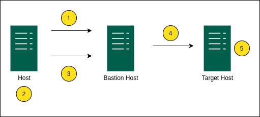

# dns-zone-checker
Simple tool to read DNS forward zone file and ssh into the server. It is designed to read the file from current host/DNS server. Then, it will use Bastion server as a jump host to ssh into target server. This tool is used to check whether a server is still available or not.

<p align="center">
  
</p>

1. Login to Bastion host.
2. Read the zone directory/files and get the ip address.
3. Send the ip address to Bastion host.
4. Bastion host login to the address.
5. If connected, execute command on target host.

## Usage
As binary:
```
./checker [flags]
```
OR

As go program:
```
go run main.go [flags]
```
### Options
```
--zone-file string         Specifies the zone file/files you want to check (eg. example.com.zone, 
                           db.example.com). Can provide multiple values separated by comma 
                           (eg. "example.com.zone,db.example.com").
--zone-dir string          Zone files directory. Specifies the directory that contains the zone files.
                           This is used when you want to check a directory of zone files.
--bastion-addr string      Address or hostname of the bastion server
--bastion-key string       SSH private key path to connect to bastion server
--bastion-user string      Username to connect to bastion server
--bastion-pass string      Password for the user to connect to bastion server
--bastion-port string      SSH port to connect to bastion server
--target-user string       Username to connect to target server
--target-pass string       Password for the target-user to connect to target server. Can provide multiple values
                           separated by comma (eg. "password,pass,abc"). It will try each of the provided password
                           to connect to the target server
--target-port string       SSH port for target server. Can provide multiple values separated by comma (eg. "22,2222")
--target-key string        SSH private key path to connect target server. Provide private key path that is in the 
                           bastion server. 
```
### Notes
1. When using `target-*` parameter, assume that you are in the bastion host. So, the private key path 
should be the path in bastion host not in the current server.

### Example 1
Check zone files in a directory (one-line):
```
./checker -zone-dir /etc/named/zones/ -bastion-addr jumphost.example.com -bastion-user bastionUser -bastion-port 22 -bastion-key /home/bastionUser/.ssh/id_rsa -target-user targetUser -target-pass="pass,pass123" -target-port="22,2222" -target-key /home/targetUser/.ssh/id_rsa
```

Check zone files in a directory (multi-line):
```
./checker \
-zone-dir /etc/named/zones/ \
-bastion-addr jumphost.example.com \
-bastion-user bastionUser \
-bastion-port 22 \
-bastion-key /home/bastionUser/.ssh/id_rsa \
-target-user targetUser \
-target-pass="pass,pass123" \
-target-port="22,2222" \
-target-key /home/targetUser/.ssh/id_rsa
```
### Example 2
Single file check (one-line):
```
./checker -bastion-addr jumphost.example.com -bastion-user bastionUser -bastion-port 22 -bastion-key /home/bastionUser/.ssh/id_rsa -target-user targetUser -target-pass="pass,pass123" -target-port="22,2222" -target-key /home/targetUser/.ssh/id_rsa -zone-file=/etc/named/zones/db.example.com
```
Single file check (multi-line):
```
./checker \
-bastion-addr jumphost.example.com \
-bastion-user bastionUser \
-bastion-port 22 \
-bastion-key /home/bastionUser/.ssh/id_rsa \
-target-user targetUser \
-target-pass="pass,pass123" \
-target-port="22,2222" \
-target-key /home/targetUser/.ssh/id_rsa \
-zone-file=/etc/named/zones/db.example.com
```
### Example 3
Multiple file check (one-line):
```
./checker -bastion-addr jumphost.example.com -bastion-user bastionUser -bastion-port 22 -bastion-key /home/bastionUser/.ssh/id_rsa -target-user targetUser -target-pass="pass,pass123" -target-port="22,2222" -target-key /home/targetUser/.ssh/id_rsa -zone-file="/etc/named/zones/db.example.com,/etc/named/zones/db.foo.com,/etc/named/zones/example.com.zone"
```
Multiple file check (multi-line):
```
./checker \
-bastion-addr jumphost.example.com \
-bastion-user bastionUser \
-bastion-port 22 \
-bastion-key /home/bastionUser/.ssh/id_rsa \
-target-user targetUser \
-target-pass="pass,pass123" \
-target-port="22,2222" \
-target-key /home/targetUser/.ssh/id_rsa \
-zone-file="/etc/named/zones/db.example.com,/etc/named/zones/db.foo.com,/etc/named/zones/example.com.zone"
```

## Limitations
1. This tool can only check one ip address in each zone file.
2. This tool has been set to read up until 451 bytes of a zone file and find if there is
any ip address until that range. Feel free to modify `readFile(zone_dir, fn string)` function if you
want to change how it should read the zone file.
3. This tool can only read DNS forward zone file.
4. For now, this tool can only check through a Bastion Server.
